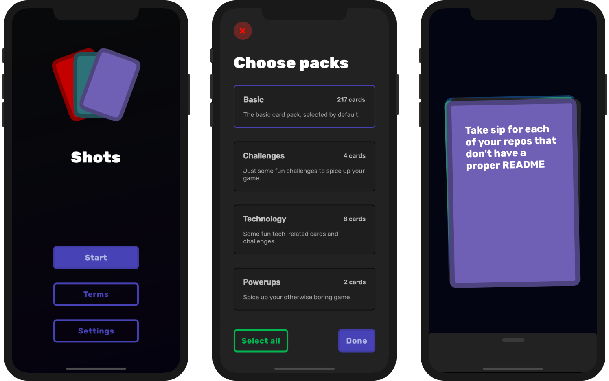
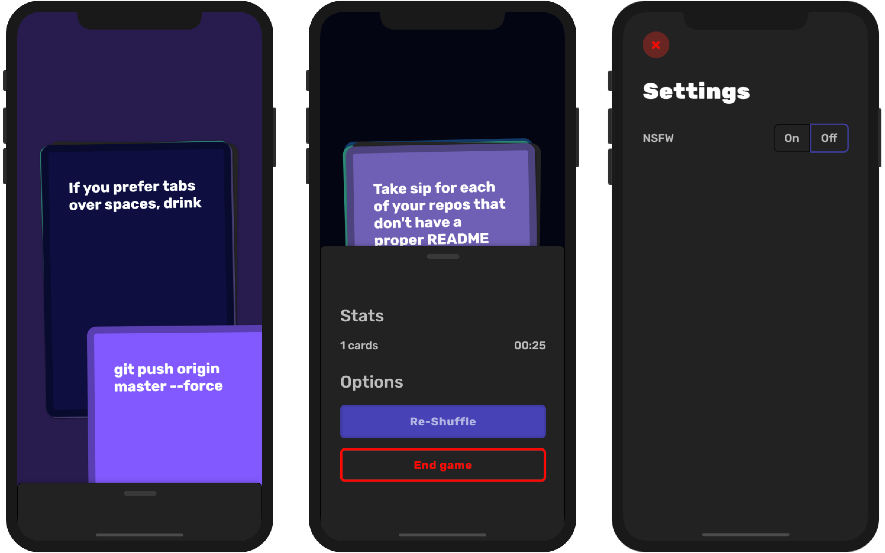
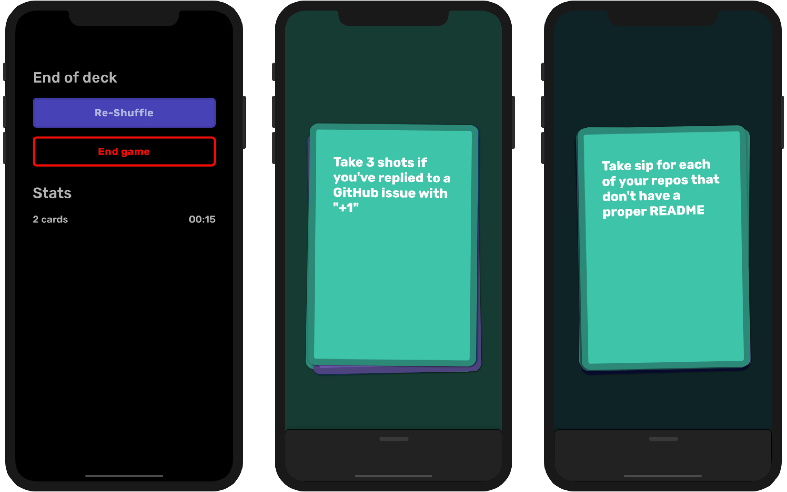

<h1 align="center"><!-- <a href="">Shots</a> --> Shots</h1>

<p align="center">A social game to help you learn more about your friends.</p>


[](http://makeapullrequest.com)
[](https://www.buymeacoffee.com/themindstorm) 
[](http://hits.dwyl.com/themindstorm/Shots) 
<!--  -->

**How to play?** One player reads out cards. All other players have to drink based off of what the card says. Those who fail to do so are out of the game. See the images below for a clearer explanation.

## Gallery




## 🚀 Features

<details>
<summary>
<b>Click to see the features list</b>
</summary>


- [x] Start page where users can see a few options
  - [x] Start game to take user to game
  - [ ] Terms (everyone is over 18, ...)
- [x] Give cards colors depending on text (for ex, if first letter is T, it is red ...)
- [x] Give app background a color too, and animate it
- [x] Rotate cards at random angles (make it look natural)
- [x] Show card behind card on top (next card)
  - [ ] Show slight animation when revealing a new "next" next card (such as slide in from top)
- [x] Randomize card order (all cards are in a YML file)
- [ ] Don't show cards which were already shown (might not implement)
- [x] Card swiping to change cards (similar to Tinder)
  - [x] Show ~~one~~ cards behind the current card
  - [ ] Make cards wave as they are moving (similar to real cards)
  - [x] Animation when user drops card but not on target (animation of card going back)
- [x] Show how many cards the players have gone through
- [x] Allow users to shuffle deck midgame
- [x] Timer to show players how long they've been playing
- [ ] Add multiple card packs
  - [x] Allow players to select and choose from different card packs (new screen)
  - [ ] Allow card packs to be retreived from web
- [x] Add settings page where people can enable NSFW mode
  - [x] Improve styling of on/off toggle

</details>


## Packages used

<details>
<summary>
<b>Click to reveal packages</b>
</summary>

- auto_route
- google_fonts
- font_awesome_flutter
- provider
- yaml
- sliding_up_panel

</details>

## FAQs
1. What is this game

    In short, it aims to get you closer to your friends through a series of interesting questions and challenges. It's intended to be played in a party setting (and with drinks of course!). There are different card packs to choose from (Basic, NSFW, Challenges, and Developer).

2. How do I play?
     - Click play and choose your card packs
     - Click "Done"
     - Start swiping the cards!

3. Can I add or suggest more cards?

    Yes. Stay tuned for further information.

## Other information
Project start date: April 9, 2020

## Build setup
Your system requires the Flutter SDK. Follow the steps here to [install](https://flutter.dev/docs/get-started/install) it on your system. After Flutter is installed, clone or fork this repository.

Once Flutter has been set up, run the app with

```
flutter run
```

The main app entry point is `main.dart`, then `app/app.dart`.

**Note**: I highly recommend you to run the debug version of the app on a physical device instead of an emulator. The card swiping action and animations are more smooth on actual devices.

### Generating icons and splash screens
After updating `pubspec.yaml`, run these commands:
```
flutter pub run flutter_launcher_icons:main
flutter pub pub run flutter_native_splash:create
```

### Editing `router.dart`
Everythime you change `router/router.dart`, you need to run

```
flutter packages pub run build_runner build --delete-conflicting-outputs
```

### Build Android APK and appbundle
```
flutter build appbundle
flutter build apk
```

It is possible that the app is on your Android device, but not fully installed. To delete it completely, connect your device to your computer, and run the following command:

```
adb uninstall com.themindstorm.shots
```

Once the APK has been built, install it on a physcally connected Android device:
```
flutter install
```

## 🎗 Support
Like this project?

- ⭐️ Star the repository
- 📩 Send a pull request to add new features
- 💌 Share this app with other developers
- 📲 Download the mobile apps (scroll to the top for links)


## Explanation
### How does the card swiping work?
Firstly, the `Draggable` widget was not used. While it is great, it does not support animating the child back to the original position when it is not dragged to the drop zone.

Instead, the method od animating the alignment by moving it to the finger position was adopted. When the child is dropped, it can be animated back to the center (`Alignment.center` in this case). See this [guide](https://flutter.dev/docs/cookbook/animation/physics-simulation).

### Steps
#### 1. Card tapped/panned down:

`controller.stop()` is called.

#### 2. Card is being panned/dragged around:

The position of the widget is being updated (`ShotCard` is a stateful widget).

```
setState(() {
  _dragAlignment += Alignment(
    // scroll sensitivity
    details.delta.dx * 3 / (size.width / 2),
    details.delta.dy * 3 / (size.height / 2),
  );
});
```

*From here on, multiple actions can take place with `onPanEnd`*:

#### 3a. The card is dropped

`_runCardBackToCenterAnimation()` is called. This function animates the `ShotCard` from its current position to `Alignment.center`.

#### 3b. The card is dropped *at the side*

When the card is dropped at the side of the screen, it means the user wants to 'dismiss' it and see the next one.

*If they're playing any game, it means that they want to discard the card and see the next one.*

We can check if the card is dropped at the side by looking at `_dragAlignment.x`:

```
if (_dragAlignment.x > 0.85) {
  _runCardLeaveAnimation();
  Future.delayed(Duration(milliseconds: _animationDuration + 100)).then((_) {
    setState(() {
      _dragAlignment = Alignment.center;
    });

    // getting next card ...
    final CardProvider cardProvider = Provider.of<CardProvider>(context, listen: false);
    cardProvider.nextCard();
  });
}
```

**What seems to be happening?**
- The card is discarded (gone)
- Next card comes into focus


**What actually happens?**
This is what's going on under the hood.

1. The card is animated out of the screen with `_runCardLeaveAnimation()`.
2. There is a slight delay (sleep). This delay **must** be more than the `_animationDuration`.
3. After the delay, the card is moved back to the center **without any animaton**.
4. Using state management to set the shot card to show the next card.

In step 2, a delay is necessary to take into account the time taken for the animation. The delay also must be higher than the animation delay. If not, then the following will happen at the same time (we don't want this):
- Animating the card out of the screen, and
- Putting the card in the center without animation.

The 'current card' that you see (on top of the others) never changes. Only it's **color**, **text**, and **rotate angle** changes, giving the appearance that it's gone and the next one is showing.
